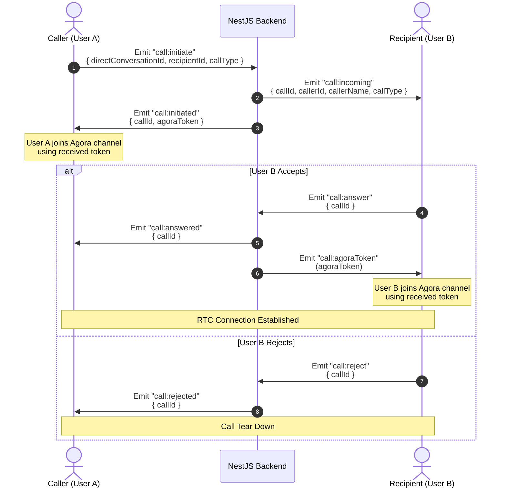

# Frontend Call Integration Guide (Agora + Socket.io)

This guide explains how to implement the 1-to-1 audio/video calling system in your frontend client.

---

## 1. Flow Overview



---

## 2. Socket.io Events Reference

### Client-to-Server Emitters

#### Initiate a Call
Start a call with a user.
* **Event**: `call:initiate`
* **Payload**:
  ```json
  {
    "directConversationId": "df17dbf4-6514-414d-bf25-97141bc70f9f",
    "recipientId": "f83770e8-1b40-476b-b383-98e64e5b8047",
    "callType": "video" // or "audio"
  }
  ```

#### Answer a Call
Accept an incoming call.
* **Event**: `call:answer`
* **Payload**:
  ```json
  {
    "callId": "3e0409bd-79f4-4120-ab0f-73ee3c407d7f"
  }
  ```

#### Reject a Call
Decline an incoming call.
* **Event**: `call:reject`
* **Payload**:
  ```json
  {
    "callId": "3e0409bd-79f4-4120-ab0f-73ee3c407d7f"
  }
  ```

#### End a Call
Hang up an active or pending call.
* **Event**: `call:end`
* **Payload**:
  ```json
  {
    "callId": "3e0409bd-79f4-4120-ab0f-73ee3c407d7f"
  }
  ```

---

### Server-to-Client Listeners

#### Incoming Call Notification (for Recipient)
Triggered when someone is calling you. Show the "Incoming Call" ringing screen.
* **Event**: `call:incoming`
* **Payload**:
  ```json
  {
    "callId": "3e0409bd-79f4-4120-ab0f-73ee3c407d7f",
    "callerId": "a964e7ee-8f70-4a92-b593-f5330e797540",
    "callerName": "John Doe",
    "callType": "video",
    "timestamp": "2026-06-14T11:15:00.000Z"
  }
  ```

#### Call Initiated (for Caller)
Sent to the caller immediately after initiating. Contains the initial token to join the channel.
* **Event**: `call:initiated`
* **Payload**:
  ```json
  {
    "callId": "3e0409bd-79f4-4120-ab0f-73ee3c407d7f",
    "agoraToken": {
      "appId": "agora_app_id_here",
      "channelName": "call_df17dbf4-6514-414d-bf25-97141bc70f9f",
      "uid": 19482749,
      "role": "publisher",
      "rtcToken": "006a964e7ee..."
    }
  }
  ```

#### Call Answered (for Caller)
Notifies the caller that the recipient accepted the call.
* **Event**: `call:answered`
* **Payload**:
  ```json
  {
    "callId": "3e0409bd-79f4-4120-ab0f-73ee3c407d7f",
    "timestamp": "2026-06-14T11:15:20.000Z"
  }
  ```

#### Recipient Agora Token (for Recipient)
Sent to the recipient after they trigger `call:answer`. Use this to join the channel.
* **Event**: `call:agoraToken`
* **Payload**:
  ```json
  {
    "appId": "agora_app_id_here",
    "channelName": "call_df17dbf4-6514-414d-bf25-97141bc70f9f",
    "uid": 39827409,
    "role": "publisher",
    "rtcToken": "006a964e7ee..."
  }
  ```

#### Call Rejected (for Caller)
Notifies the caller that the recipient declined.
* **Event**: `call:rejected`
* **Payload**:
  ```json
  {
    "callId": "3e0409bd-79f4-4120-ab0f-73ee3c407d7f"
  }
  ```

#### Call Ended (for Both)
Notifies the other participant that the call was hung up.
* **Event**: `call:ended`
* **Payload**:
  ```json
  {
    "callId": "3e0409bd-79f4-4120-ab0f-73ee3c407d7f",
    "duration": 45, // in seconds
    "timestamp": "2026-06-14T11:16:05.000Z"
  }
  ```

---

## 3. Web Frontend Implementation Example

Here is an implementation template using **React** and the **Agora Web SDK (`agora-rtc-sdk-ng`)**:

```javascript
import React, { useEffect, useState, useRef } from 'react';
import AgoraRTC from 'agora-rtc-sdk-ng';
import { io } from 'socket.io-client';

const socket = io('http://localhost:5000/chat', { auth: { token: 'YOUR_JWT_TOKEN' } });

export default function VideoCallComponent() {
  const [activeCallId, setActiveCallId] = useState(null);
  const [incomingCall, setIncomingCall] = useState(null);
  const [callState, setCallState] = useState('idle'); // idle, ringing, calling, connected
  
  const agoraClient = useRef(null);
  const localAudioTrack = useRef(null);
  const localVideoTrack = useRef(null);

  useEffect(() => {
    // 1. Listen for incoming calls
    socket.on('call:incoming', (data) => {
      setIncomingCall(data);
      setCallState('ringing');
    });

    // 2. Listener for Caller (Recipient answered)
    socket.on('call:answered', async (data) => {
      setCallState('connected');
    });

    // 3. Listener for Caller (Recipient rejected)
    socket.on('call:rejected', () => {
      resetCallUI('Rejected');
    });

    // 4. Listener for both (Call ended)
    socket.on('call:ended', (data) => {
      leaveAgoraChannel();
      resetCallUI(`Call ended. Duration: ${data.duration}s`);
    });

    // 5. Receive Agora token (for Recipient)
    socket.on('call:agoraToken', async (agoraData) => {
      await joinAgoraChannel(agoraData);
    });

    return () => {
      socket.off('call:incoming');
      socket.off('call:answered');
      socket.off('call:rejected');
      socket.off('call:ended');
      socket.off('call:agoraToken');
    };
  }, []);

  // --- ACTIONS ---

  // Initiate Call (Caller)
  const initiateCall = (recipientId, conversationId, type = 'video') => {
    setCallState('calling');
    socket.emit('call:initiate', {
      directConversationId: conversationId,
      recipientId,
      callType: type
    }, async (response) => {
      if (response.error) {
        resetCallUI(response.error);
        return;
      }
      
      setActiveCallId(response.callId);

      // Listen for initial token setup
      socket.once('call:initiated', async (initiatedData) => {
        await joinAgoraChannel(initiatedData.agoraToken, type);
      });
    });
  };

  // Answer Call (Recipient)
  const answerCall = () => {
    if (!incomingCall) return;
    setCallState('connected');
    setActiveCallId(incomingCall.callId);
    
    socket.emit('call:answer', { callId: incomingCall.callId });
    setIncomingCall(null);
  };

  // Reject Call (Recipient)
  const rejectCall = () => {
    if (!incomingCall) return;
    socket.emit('call:reject', { callId: incomingCall.callId });
    resetCallUI('Declined');
  };

  // End Call (Either)
  const endCall = () => {
    if (!activeCallId) return;
    socket.emit('call:end', { callId: activeCallId });
    leaveAgoraChannel();
    resetCallUI('Hung up');
  };

  // --- AGORA UTILITIES ---

  const joinAgoraChannel = async (agoraData, callType = 'video') => {
    // Create Agora RTC client
    agoraClient.current = AgoraRTC.createClient({ mode: 'rtc', codec: 'vp8' });
    
    // Join the channel using the generated token
    await agoraClient.current.join(
      agoraData.appId,
      agoraData.channelName,
      agoraData.rtcToken,
      agoraData.uid
    );

    // Create and publish local tracks (audio and optionally video)
    localAudioTrack.current = await AgoraRTC.createMicrophoneAudioTrack();
    const tracksToPublish = [localAudioTrack.current];

    if (callType === 'video') {
      localVideoTrack.current = await AgoraRTC.createCameraVideoTrack();
      tracksToPublish.push(localVideoTrack.current);
      
      // Play local video stream
      localVideoTrack.current.play('local-video-element-id');
    }

    await agoraClient.current.publish(tracksToPublish);

    // Subscribe to remote streams
    agoraClient.current.on('user-published', async (user, mediaType) => {
      await agoraClient.current.subscribe(user, mediaType);
      
      if (mediaType === 'video') {
        user.videoTrack.play('remote-video-element-id');
      }
      if (mediaType === 'audio') {
        user.audioTrack.play();
      }
    });
  };

  const leaveAgoraChannel = () => {
    if (localAudioTrack.current) {
      localAudioTrack.current.close();
      localAudioTrack.current = null;
    }
    if (localVideoTrack.current) {
      localVideoTrack.current.close();
      localVideoTrack.current = null;
    }
    if (agoraClient.current) {
      agoraClient.current.leave();
      agoraClient.current = null;
    }
  };

  const resetCallUI = (reason) => {
    console.log('Call state reset due to:', reason);
    setCallState('idle');
    setIncomingCall(null);
    setActiveCallId(null);
  };

  return (
    <div>
      {/* Build your call controls UI depending on callState state here */}
    </div>
  );
}
```
